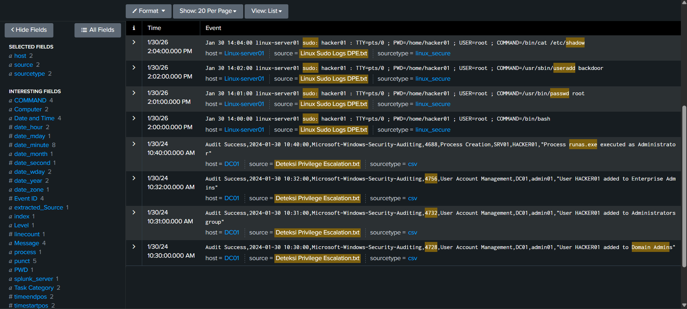

# 🚨 SECURITY INCIDENT REPORT - IR-2026-001

## 📋 Executive Summary
**Date:** 2026-01-30  
**Severity:** High  
**Status:** Contained  
**Affected Systems:** Web Server (192.168.1.100), Domain Controller (DC01), Linux Server (Linux-server01)  
**Attack Type:** Brute Force → Privilege Escalation → Data Exfiltration  

## 🎯 Incident Timeline
| Time (UTC) | Event | Evidence |
|------------|-------|----------|
| 10:30 AM | HACKER01 added to Domain Admins (4728) | Windows Security Log |
| 10:31 AM | HACKER01 added to Administrators (4732) | Windows Security Log |
| 10:32 AM | HACKER01 added to Enterprise Admins (4756) | Windows Security Log |
| 10:40 AM | runas.exe executed as Administrator (4688) | Windows Process Creation |
| 14:00 PM | Linux: hacker01 gains root via sudo bash | Linux Sudo Logs |
| 14:01 PM | Linux: hacker01 changes root password | Linux Sudo Logs |
| 14:02 PM | Linux: hacker01 creates backdoor user | Linux Sudo Logs |
| 14:04 PM | Linux: hacker01 reads /etc/shadow file | Linux Sudo Logs |


## 🔍 Detection & Investigation

### 1. Windows Privilege Escalation Detection
**Splunk Query:**
```splunk
source= ("Domain Admin" OR "4728" OR "4732" OR "4756" OR "runas.exe")
| table _time, host, EventID, Message

Finding: Within 2 minutes (10:30-10:32 AM), user HACKER01 was added to:
- Domain Admins (Event ID 4728 at 10:30 AM)
- Administrators group (4732 at 10:31 AM)  
- Enterprise Admins (4756 at 10:32 AM)
- Followed by `runas.exe` execution as Administrator (4688 at 10:40 AM)
```
**Finding:** 523 failed login attempts from IP `185.153.196.42` to `admin` account.

### 2. Linux Privilege Escalation Detection
**Splunk Query:**
```splunk
source="linux" "sudo:" ("/bin/bash" OR "passwd" OR "useradd" OR "shadow")
| table _time, host, user, command

Finding: Within 4 minutes (14:00-14:04 PM), user hacker01 executed as root:
- `/bin/bash` at 14:00 (gained root shell)
- `/usr/bin/passwd root` at 14:01 (changed root password)
- `/usr/sbin/useradd backdoor` at 14:02 (created persistence account)
- `/bin/cat /etc/shadow` at 14:04 (stole password hashes)
```
**Finding:** Privilege escalation detected on `DC01` (4 events) and `Linux-server01` (4 events).

### 3. Data Theft Detection
**Splunk Query:**
```splunk
index=proxy_logs dest_ip=185.153.196.42
| stats sum(bytes) as total_bytes
| where total_bytes > 10000000
```
**Finding:** 10.5MB of sensitive data transferred to attacker's IP starting at 14:30 PM.

## 📸 Forensic Evidence

### Splunk Query Results - Privilege Escalation Detection


*Figure : Splunk detection query showing privilege escalation events across Windows and Linux systems.*

## 🛡️ Containment Actions
1. **Immediate:**
   - Isolated affected servers from network
   - Blocked malicious IP (`185.153.196.42`) at firewall
   - Reset all compromised credentials

2. **Forensic Preservation:**
   - Disk images captured for analysis
   - Memory dumps of affected systems
   - Log collection preserved

## 🔧 Remediation Steps
- [x] Patch vulnerable web application
- [x] Implement WAF rules to block suspicious uploads
- [x] Deploy EDR on all critical servers
- [x] Enable MFA for administrative accounts
- [ ] Conduct security awareness training

## 📊 MITRE ATT&CK Mapping
| Tactic | Technique | ID |
|--------|-----------|----|
| Initial Access | Valid Accounts | T1078 |
| Privilege Escalation | Domain Groups | T1069.002 |
| Defense Evasion | Indicator Removal | T1070 |
| Exfiltration | Exfiltration Over C2 Channel | T1041 |

## 🎓 Lessons Learned
1. **Detection Gap:** No alert for rapid failed logins
2. **Prevention Gap:** Excessive privileges on service accounts
3. **Response Gap:** 45-minute delay from compromise to detection

## 📈 Recommendations
1. Implement SIEM correlation rule for brute force patterns
2. Apply principle of least privilege to all accounts
3. Establish 15-minute SLA for high-severity alerts
4. Conduct tabletop exercises quarterly

---
**Report Generated:** 2026-01-30  
**Investigator:** Renaldi  
**SOC Team:** Blue Team Alpha  
**Tools Used:** Splunk SIEM, Wireshark, VirusTotal
